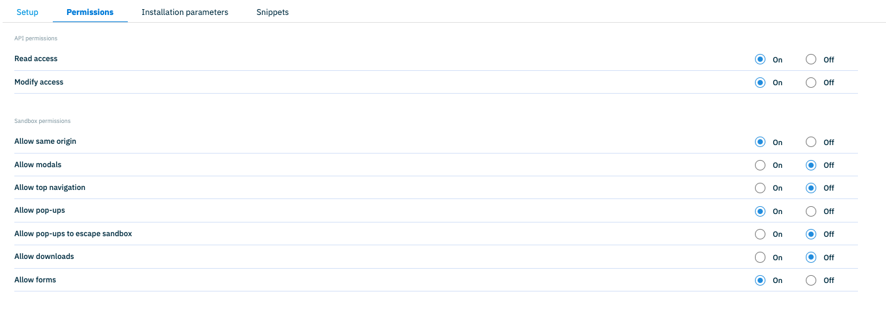
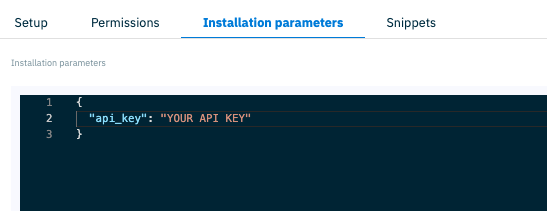

# dc-extension-unsplash-demo

This project demonstrates the use of the [dc-extensions-sdk](https://github.com/amplience/dc-extensions-sdk), enabling the creation of custom extensions for Dynamic Content. Extensions are custom form controls used within the content editing interface of the Dynamic Content platform.

This extension is a React application that integrates with the [Unsplash API](https://unsplash.com/documentation#getting-started) to display images within an Amplience Content Item. Users can select an image and save its associated URL and alt text values.

Additionally, the extension includes a search functionality that allows users to find images based on specific keywords.

## Features

- Fetches a set of random images from the Unsplash API.
- Allows users to select an image and save its associated URL and alt text.
- Provides a search functionality for finding images based on keywords.
- Automatically updates URL and alt text values when a new image is selected.

## Deployment

To use this extension, you must first fork this repository and deploy the application to a hosting provider such as Netlify, Vercel, or a similar platform. 

**Important:** The extension is designed to work specifically within Amplience as an integrated extension and requires a valid Unsplash API Key for functionality.

## Installation

After deploying the application, follow these steps to integrate it with Amplience:

1. **Create and Configure a New Extension**  
   Register the app as an extension in the Amplience platform.

2. **Create a Content Type**  
   Define a Content Type that incorporates the newly created extension.

3. **Create a Content Item**  
   Build a Content Item using the Content Type configured in the previous step.

For detailed instructions on registering and using a new extension, refer to the [Amplience documentation](https://amplience.com/developers/docs/integrations/extensions/register-use/).

## Required Permissions

Assign the following permissions to ensure the extension functions correctly:

## Installation Parameters

When registering the extension, add your Unsplash API key to the Installation Parameters to enable API access. 

